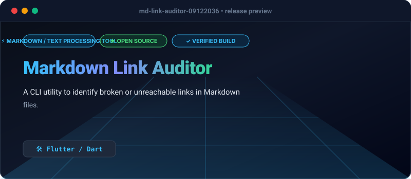

# Markdown Link Auditor

[](https://github.com/Olamideakinade/md-link-auditor-09122036)
[](https://opensource.org/licenses/MIT)



A Flutter/Dart command-line tool designed to scan Markdown files and verify the status of external URLs. It identifies broken links by performing HEAD requests and reporting status codes.

## Capabilities
- Recursive directory scanning for .md files.
- Concurrent HTTP HEAD requests for high-speed link verification.
- Detailed console output showing file path, line number, and HTTP error code.
- Exit codes compliant with CI/CD pipelines (0 on success, 1 on broken links).

## Quickstart
```bash
# Activate the package
dart pub global activate md_link_auditor

# Run against a directory
md-link-auditor scan ./docs
```

## Architecture
- `bin/main.dart`: CLI entry point using `args` for command parsing.
- `lib/src/scanner.dart`: File system traversal logic.
- `lib/src/verifier.dart`: HTTP client pool for link validation.
- `lib/src/parser.dart`: Regex-based Markdown link extraction.

## License
MIT